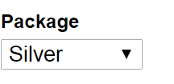
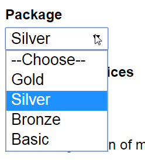

[<- Back to Table of Contents](../README.md)

# data-select

Bind an array of JSON objects to an HTML `<select>` tag.

All validation is fired on `change`.

## Usage

Given the JSON data:

```javascript
{
    user: {
        package: {id: 'silver'}
    },
    packages: [
        {id:'gold', label: 'Gold'},
        {id:'silver', label: 'Silver'},
        {id: 'bronze', label: 'Bronze'},
        {id: 'basic', label: 'Basic'}
    ]
}
```
Use as follows:

```HTML
<select 
    name="package" 
    is="data-select" 
    items="[[packages]]"
    placeholder="--Choose--"
    selected-item="{{user.package}}"
    required></select>
```

To get the output:

 <br>



## Properties

`items: Array`

An array of possible selections for the user to choose from.

`placeholder: String`

The label for an option that should be selected by default when
there is no `selectedItem` defined. 

`labelField: String` 

When building the list of `<option>` elements, this property defines which key of each item in the `items` property to use
as the `option.innerHTML` value.

Inherited from [DataElementBehaviors.OptionList](behaviors-option-list.md):

- `selectedItem: String`
- `valueField: String`

*All other HTML5 properties; currently does not support `multiple`.
I recommend using a [data-selector](data-selector.md) for that.

## Methods

Inherited from [DataElementBehaviors.Basic](behaviors-basic.md):

 - `addValidator(validatorFunction, errorMessage)`
 - `on(eventName, handlerFunction)`
 - `setValidity(isValid, errorMessage)`
 - `validate(): Boolean` (*override*)

*All other HTML5 methods.

## Events

 Inherited from [DataElementBehaviors.Basic](behaviors-basic.md):

 - `data-element-added`
 - `validation`

*All other HTML5 events.

## Behaviors

- [DataElementBehaviors.Basic](behaviors-basic.md)
- [DataElementBehaviors.OptionList](behaviors-option-list.md)
