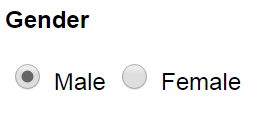
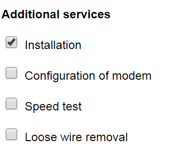

[<- Back to Table of Contents](../README.md)

# data-selector

This isn't really a control, but rather a utility tag for ticking the
correct checkboxes or radio buttons in an options array.

All validation is fired on `change`.

This tag is meant for use with objects or object arrays. For flat
data structures such as Strings, see the 
[simple-data-selector](simple-data-selector.md).

## Usage

Given the following source data:

```javascript

{ 
    user: {
        //Other fields..
        gender: { id: 'male' }
    },
    genders: [
        {id: 'male', label: 'Male'}, 
        {id: 'female', label: 'Female'} 
    ]
}

```

You can provide radio buttons as such:

```html
<data-selector name="gender" selected-item="{{user.gender}}">
    <template is="dom-repeat" items="[[genders]]">
        <input type="radio" name="gender" value="[[item.id]]" id="radio-[[item.id]]"> <label for$="radio-[[item.id]]">[[item.label]]</label>
    </template>
</data-selector>
```

To get the following result:



As the user interacts with the radio buttons, the `user.gender` field in the
JSON data gets updated automatically due to the two-way binding.

You can also use a `data-selector` for handling a checkbox array too. Just
set the `multiple` attribute.

```javascript
{
    user: {
        requiredServices: [
            {id:'install', label: 'Installation'},
        ]
    },
    services: [
        {id:'install', label: 'Installation'},
        {id:'configure', label: 'Configuration of modem'},
        {id: 'testing', label: 'Speed test'},
        {id: 'cleanup', label: 'Loose wire removal'}
    ]
}
```

```html
<data-selector name="services" multiple selected-items="{{user.requiredServices}}">
    <template is="dom-repeat" items="[[services]]">
        <p>
            <input type="checkbox" value="[[item.id]]" id="checkbox-[[item.id]]"> 
            <label for$="checkbox-[[item.id]]">[[item.label]]</label>
        </p>
    </template>
</data-selector>
```

Doing the above will get you this:



## Properties
 
 Inherited from [DataElementBehaviors.Basic](behaviors-basic.md):
 
 - `error: String`
 - `name: String`
 - `valid: Boolean`

 Inherited from [DataElementBehaviors.OptionList](behaviors-option-list.md):

 - `multiple: Boolean`
 - `selectedItem: Object`
 - `selectedItems: Array`
 - `required: Boolean`
 - `valueField: String`


## Methods

 Inherited from [DataElementBehaviors.Basic](behaviors-basic.md):

 - `addValidator(validatorFunction, errorMessage)`
 - `on(eventName, handlerFunction)`
 - `setValidity(isValid, errorMessage)`

 Inherited from [DataElementBehaviors.DataSelector](behaviors-data-selector.md):

 -  `validate()`

## Events

Inherited from [DataElementBehaviors.Basic](behaviors-basic.md):

 - `data-element-added`
 - `validation`

## Behaviors

- [DataElementBehaviors.Basic](behaviors-basic.md)
- [DataElementBehaviors.OptionList](behaviors-option-list.md)
- [DataElementBehaviors.DataSelector](behaviors-data-selector.md)