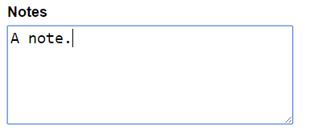

[<- Back to Table of Contents](../README.md)

# data-text-area

Aside from the tag name, `data-text-area` is almost identical
to `data-text-input`. These two were split into separate elements simply because, as of Polymer 1.7, you can't
extend two elements.

All validation is fired first on `blur`, then on `input`.

## Usage

Given the JSON data:

```javascript
{
    user: {
        notes: 'A note.'
    }
}
```

Use as follows:

```HTML
<textarea 
        name="notes" 
        cols="30" 
        rows="5" 
        is="data-text-area" 
        model="{{user.notes}}"></textarea>
```

To get the output:



## Properties

 Inherited from [DataElementBehaviors.Basic](behaviors-basic.md):
 
 - `error: String`
 - `model: String`
 - `name: String`
 - `valid: Boolean`

 Inherited from [DataElementBehaviors.TextField](behaviors-text-field.md);

 - `pristine: Boolean`
 - `touched: Boolean` 

 *All other HTML5 properties.

## Methods

Inherited from [DataElementBehaviors.TextField](behaviors-text-field.md);

- `validate(): Boolean` (*override*)

*All other HTML5 methods.

## Events

Inherited from [DataElementBehaviors.Basic](behaviors-basic.md):

 - `data-element-added`
 - `validation`

*All other HTML5 events.

## Behaviors

- [DataElementBehaviors.Basic](behaviors-basic.md)
- [DataElementBehaviors.OptionList](behaviors-option-list.md)


